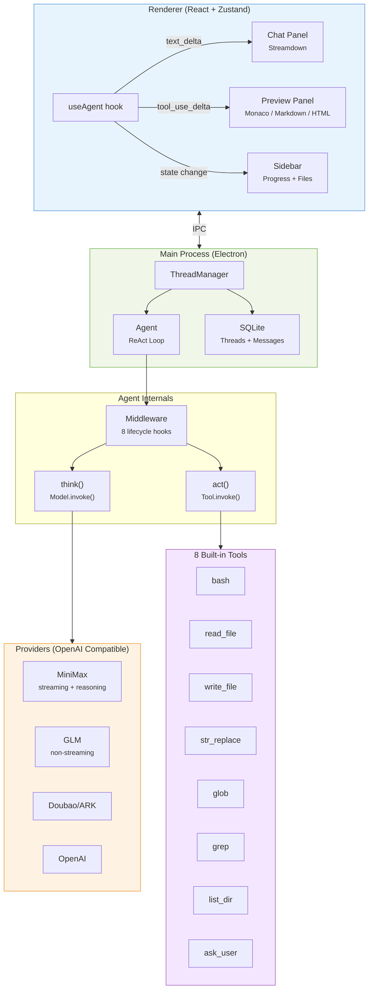

<p align="center">
  
</p>

<h1 align="center">TinyCodex</h1>

<p align="center">
  <strong>Lightweight Electron AI coding assistant with real-time streaming preview</strong>
</p>

<p align="center">
  <a href="#features">Features</a> &middot;
  <a href="#demo">Demo</a> &middot;
  <a href="#quick-start">Quick Start</a> &middot;
  <a href="#architecture">Architecture</a> &middot;
  <a href="README.zh-CN.md">中文</a>
</p>

<p align="center">
  
  
  
  
</p>

---

Open a local project, chat with an LLM agent that reads, writes, and executes code. Watch files render in real-time as the agent types — markdown, HTML, code, and more.

## Demo

<p align="center">
  <a href="https://github.com/venaissance/tiny-codex/releases/download/v1.0.0/tiny-codex.mp4">
    
  </a>
  <br />
  <em>Real-time markdown streaming preview — <a href="https://github.com/venaissance/tiny-codex/releases/download/v1.0.0/tiny-codex.mp4">click to watch demo video</a></em>
</p>

<p align="center">
  
  <br />
  <em>HTML live preview with progress tracking and dark theme</em>
</p>

## Features

**Agent**
- ReAct loop with 8 built-in tools — bash, read/write file, str_replace, glob, grep, list_dir, ask_user
- Skills system — extend agent capabilities via markdown-defined custom tools
- Trajectory recording — full step history for debugging

**Streaming**
- Token-by-token chat output with rAF-batched rendering
- Live file preview — see content appear in the preview panel as the agent writes
- Expandable thinking card — watch LLM reasoning in real-time
- Progress sidebar — thinking, tool call, reflecting, done

**Preview**
- Markdown (Streamdown + Shiki syntax highlighting)
- HTML (sandboxed iframe)
- Code (Monaco Editor with diff view)
- Image, PDF, CSV, JSON

**Providers**

| Provider | Streaming | Notes |
|----------|-----------|-------|
| MiniMax | Yes | `reasoning_split=true` auto-enabled |
| GLM (ZhipuAI) | No | Non-streaming fallback |
| Doubao/ARK | Yes | ByteDance Volcano Engine |
| OpenAI | Yes | Any OpenAI-compatible endpoint |

## Quick Start

```bash
pnpm install
cp .env.example .env   # add your API key
pnpm run dev
```

## Architecture



**Four layers, strict top-down dependency:**

| Layer | What it does |
|-------|-------------|
| **Foundation** | Model/Provider interface, message types, `defineTool()` |
| **Agent** | ReAct loop, middleware chain (8 hooks), context compaction |
| **Coding** | Tool implementations, `createCodingAgent()` factory |
| **App** | Electron window, IPC, React UI, preview panel |

## Project Structure

```
src/
├── foundation/     # Model/Provider abstraction, message types, tool framework
├── agent/          # ReAct loop, middleware, compaction, trajectory
├── coding/         # 8 standard tools, agent factory, worktree manager
├── community/      # OpenAI + Mock providers, shared stream types
├── main/           # Electron main process, IPC, SQLite, window
├── renderer/       # React UI, Zustand stores, hooks, components
└── shared/         # IPC channel constants
```

## Testing

```bash
pnpm test                # 220 unit/component/integration tests
npx playwright test      # E2E with mock LLM (no API key needed)
```

| Category | Tests | Coverage |
|----------|-------|---------|
| Unit | 120+ | Agent, tools, providers, stores, streaming logic |
| Component | 55+ | AgentProcess, MessageHistory, Sidebar, Preview, InputBox |
| Integration | 14 | ThreadManager, agent-tools, skills |
| E2E | 5 | Smoke, streaming preview, full workflow |

## Build

```bash
pnpm run build     # production build
pnpm run pack      # macOS .app (directory)
pnpm run release   # macOS .dmg
```

## License

[MIT](LICENSE)
