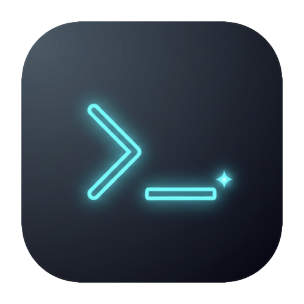
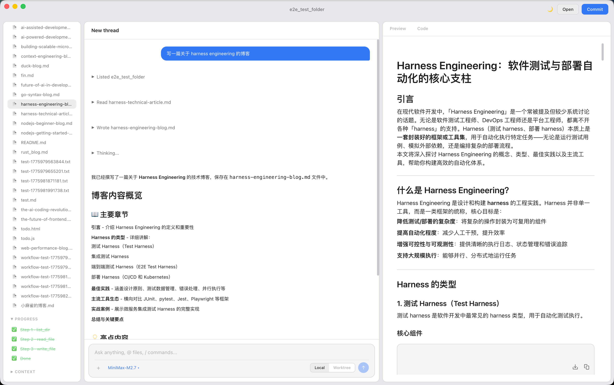
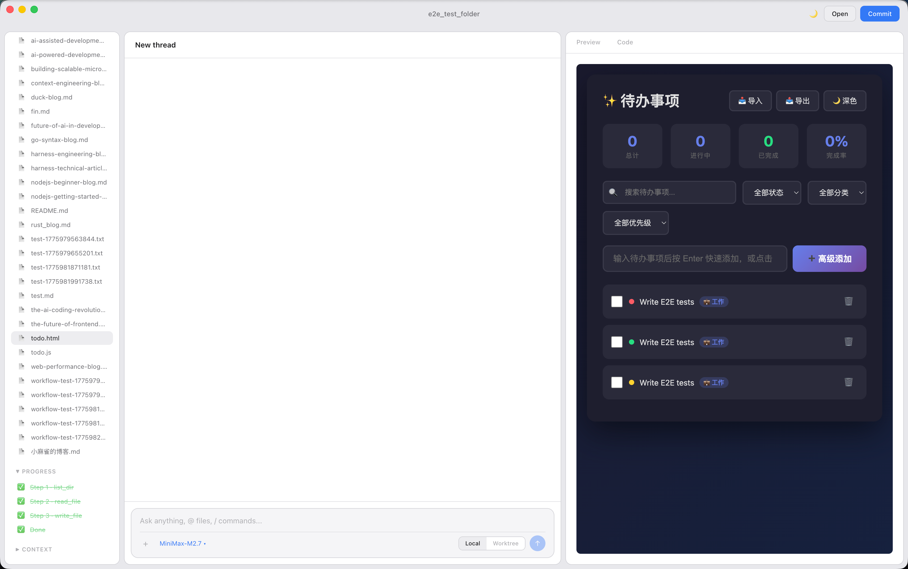
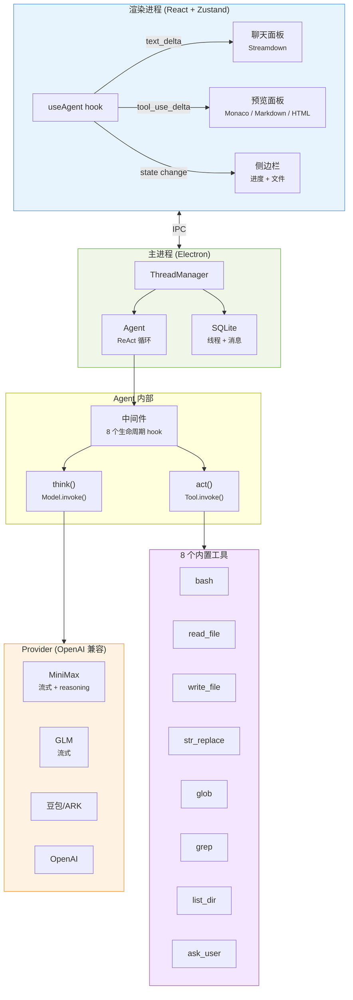

<p align="center">
  
</p>

<h1 align="center">TinyCodex</h1>

<p align="center">
  <strong>你的本地 AI 编程助手 — 写代码、实时预览、一键发布，一个窗口搞定。</strong>
</p>

<p align="center">
  <a href="#适合谁用">适合谁</a> &middot;
  <a href="#演示">演示</a> &middot;
  <a href="#功能特性">功能</a> &middot;
  <a href="#快速开始">快速开始</a> &middot;
  <a href="#从源码学习">学习</a> &middot;
  <a href="README.md">English</a>
</p>

<p align="center">
  
  
  
  
</p>

---

TinyCodex 是一个桌面应用，让任何 LLM 变成你的编程 Agent。指定一个本地文件夹，描述你想做的事，看着它读文件、写代码、执行命令、渲染结果 — 全部实时。

不上云。不订阅。你的 API Key，你的机器，你的代码。

## 适合谁用

| 你是... | TinyCodex 能帮你... |
|---------|-------------------|
| **技术博客写作者** | 一句话生成完整 Markdown 博客 — 边写边在右侧实时预览渲染效果 |
| **编程小白** | 用自然语言描述需求，AI 自动读取项目结构并写出能运行的代码 |
| **职场白领** | 生成 HTML 报告、待办应用、数据分析脚本，不需要打开终端 |
| **Agent 开发者** | 学习一个干净可读的 ReAct 实现 — 四层架构、8 个中间件 hook、完整流式管线 |

## 演示

https://github.com/user-attachments/assets/d48351a3-be5d-4de1-a045-e8a7facb007f

<p align="center">
  
  <br/>
  <em>输入「写一篇技术博客」— 右侧实时渲染 Agent 正在写的 Markdown</em>
</p>

<p align="center">
  
  <br/>
  <em>生成 HTML 待办应用 — 实时预览 + 进度追踪 + 深色主题</em>
</p>

## 功能特性

### 你能看到的

- **实时流式预览** — Agent 写文件时右侧同步渲染（Markdown、HTML、代码、图片、PDF、CSV）
- **思考卡片** — 展开查看 AI 的实时推理过程
- **任务规划** — Agent 先列出计划，再逐步执行打勾
- **欢迎页** — 新建线程时显示快速开始卡片；未打开项目时禁用
- **建议按钮** — 每次回复后自动生成可点击的后续操作（模型生成或正则提取）
- **文件管理** — 树形目录、新建/重命名/删除文件、右键菜单

### 底层能力

- **ReAct Agent 循环** — 思考 → 行动 → 观察 → 重复。8 个内置工具：bash、读写文件、str_replace、glob、grep、list_dir、ask_user
- **流式管线** — SSE → rAF 批量合并 → Streamdown 渲染 → 自动滚动。不闪烁，不卡顿。
- **多模型支持** — MiniMax、GLM、豆包、OpenAI — 任何 OpenAI 兼容 API。按 Provider 控制流式开关。
- **中间件系统** — 8 个生命周期 hook（beforeModel、afterToolUse 等）。Planner 和 Skills 都只是中间件。
- **Skills 扩展** — 在 `skills/` 放一个 Markdown 文件 → Agent 获得新工具。不需要写代码。
- **Worktree 模式** — 在隔离的 git 分支中运行 Agent。安全实验。

### 模型提供商

| 提供商 | 流式输出 | 备注 |
|--------|---------|------|
| MiniMax | 支持 | 推荐。自动启用 `reasoning_split=true` |
| GLM (智谱) | 支持 | 流式已启用（URL bug 已修复） |
| 豆包/ARK | 支持 | 字节跳动火山引擎 |
| OpenAI | 支持 | 任何 OpenAI 兼容端点 |

## 快速开始

```bash
git clone https://github.com/venaissance/tiny-codex.git
cd tiny-codex
pnpm install
cp .env.example .env   # 填入你的 API Key（推荐 MiniMax）
pnpm run dev            # 使用 vite build --watch（非 dev server）
```

> **注意：** 开发模式使用 `vite build --watch` 而非 Vite dev server。因为 Tailwind v4 的 `@tailwindcss/vite` 在 dev server 模式下不会编译 utility class。

**第一件事：** 打开一个项目文件夹，然后点击欢迎页的快速开始卡片。看 Agent 规划、写作、预览 — 全部流式。

### 下载

> [TinyCodex-1.0.0-arm64.dmg](https://github.com/venaissance/tiny-codex/releases/download/v1.0.0/TinyCodex-1.0.0-arm64.dmg) (macOS Apple Silicon)

## 从源码学习

TinyCodex 的设计目标之一是可读。如果你在学习如何构建 AI Agent，以下是导读路线：

### 1. Agent 循环（~200 行）

`src/agent/agent.ts` — 完整的 ReAct 循环。阅读 `stream()` 方法，看 think → act → yield 的流程。

### 2. 工具系统（每个 ~20 行）

`src/coding/tools/` — 每个工具一个文件：Schema (Zod) + invoke 函数。从 `bash.ts` 开始看。

### 3. 流式管线

`src/renderer/hooks/useAgent.ts` — SSE delta 如何变成像素。跟踪 `text_delta`（聊天区）、`thinking_delta`（思考卡片）、`tool_use_delta`（实时文件预览）。

### 4. 中间件

`src/agent/middleware.ts`（接口）+ `src/agent/middlewares/planner.ts`（实现）— 如何拦截 Agent 循环。8 个 hook，全部可选。

### 5. Provider 抽象

`src/community/openai/provider.ts` — 一个文件接入任何 OpenAI 兼容 API。处理流式、非流式、工具调用和推理。

## 架构



**四层架构，严格自上而下依赖：**

| 层 | 职责 |
|----|------|
| **Foundation** | Model/Provider 接口、消息类型、`defineTool()` |
| **Agent** | ReAct 循环、中间件链（8 个 hook）、上下文压缩 |
| **Coding** | 工具实现、`createCodingAgent()` 工厂 |
| **App** | Electron 窗口、IPC 处理、React UI、预览面板 |

## 项目结构

```
src/
├── foundation/     # Model/Provider 抽象、消息类型、工具框架
├── agent/          # ReAct 循环、中间件、压缩、轨迹记录
│   └── middlewares/  # Planner、Skills（通过中间件接口插入）
├── coding/         # 8 个标准工具、Agent 工厂、Worktree 管理
├── community/      # OpenAI + Mock Provider、共享流式类型
├── main/           # Electron 主进程、IPC、SQLite、窗口
├── renderer/       # React UI、Zustand 状态管理、组件
│   ├── hooks/        # useAgent（流式）、useThread（生命周期）
│   └── components/   # ChatPanel、Sidebar、PreviewPanel、InputBox
└── shared/         # IPC 通道常量
```

## 测试

```bash
pnpm test                # 240+ 单元/组件/集成测试
npx playwright test      # E2E（Mock LLM，无需 API Key）
```

| 类别 | 数量 | 覆盖范围 |
|------|------|---------|
| 单元测试 | 130+ | Agent 循环、工具、Provider、Store、流式事件、Planner 中间件 |
| 组件测试 | 60+ | AgentProcess、MessageHistory、Sidebar、Preview、InputBox、SuggestionCards、FileExplorer |
| 集成测试 | 14 | ThreadManager、Agent-Tools、Skills 系统 |
| E2E | 5 个场景 | Smoke、流式预览、完整工作流 |

## 构建

```bash
pnpm run build     # 生产构建
pnpm run pack      # macOS .app（目录模式）
pnpm run release   # macOS .dmg
```

## 贡献

查看 [CONTRIBUTING.md](CONTRIBUTING.md) 了解开发环境、代码规范和 PR 指南。

## 许可证

[MIT](LICENSE)
