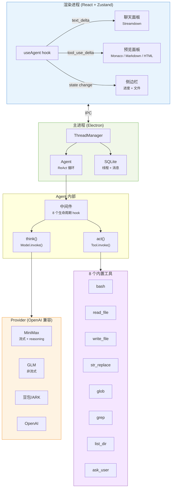

<p align="center">
  
</p>

<h1 align="center">TinyCodex</h1>

<p align="center">
  <strong>轻量级 Electron AI 编程助手，支持实时流式预览</strong>
</p>

<p align="center">
  <a href="#功能特性">功能</a> &middot;
  <a href="#演示">演示</a> &middot;
  <a href="#快速开始">快速开始</a> &middot;
  <a href="#架构">架构</a> &middot;
  <a href="README.md">English</a>
</p>

<p align="center">
  
  
  
  
</p>

---

打开本地项目，与 LLM Agent 对话，让它帮你读写和执行代码。Agent 写文件时，右侧面板实时渲染 — Markdown、HTML、代码等。

## 演示

https://github.com/user-attachments/assets/d48351a3-be5d-4de1-a045-e8a7facb007f

<p align="center">
  
  <br />
  <em>Agent 写博客时实时渲染 Markdown 预览</em>
</p>

<p align="center">
  
  <br />
  <em>HTML 实时预览，含进度追踪和深色主题</em>
</p>

## 功能特性

**Agent**
- ReAct 循环 + 8 个内置工具 — bash、读写文件、str_replace、glob、grep、list_dir、ask_user
- Skills 扩展 — 通过 Markdown 文件定义自定义工具
- 轨迹记录 — 完整步骤历史，方便调试

**流式输出**
- 逐 token 聊天输出，rAF 批量渲染
- 实时文件预览 — Agent 写文件时，预览面板同步显示内容
- 可展开的思考卡片 — 实时查看 LLM 推理过程
- 进度侧边栏 — thinking → tool call → reflecting → done

**预览**
- Markdown（Streamdown + Shiki 语法高亮）
- HTML（沙箱 iframe）
- 代码（Monaco Editor + Diff 视图）
- 图片、PDF、CSV、JSON

**模型提供商**

| 提供商 | 流式输出 | 备注 |
|--------|---------|------|
| MiniMax | 支持 | 自动启用 `reasoning_split=true` |
| GLM (智谱) | 不支持 | 非流式回退 |
| 豆包/ARK | 支持 | 字节跳动火山引擎 |
| OpenAI | 支持 | 任何 OpenAI 兼容端点 |

## 快速开始

```bash
pnpm install
cp .env.example .env   # 填入你的 API Key
pnpm run dev
```

## 架构



**四层架构，严格自上而下依赖：**

| 层 | 职责 |
|----|------|
| **Foundation** | Model/Provider 接口、消息类型、`defineTool()` |
| **Agent** | ReAct 循环、中间件链（8 个 hook）、上下文压缩 |
| **Coding** | 工具实现、`createCodingAgent()` 工厂 |
| **App** | Electron 窗口、IPC、React UI、预览面板 |

## 项目结构

```
src/
├── foundation/     # Model/Provider 抽象、消息类型、工具框架
├── agent/          # ReAct 循环、中间件、压缩、轨迹记录
├── coding/         # 8 个标准工具、Agent 工厂、Worktree 管理
├── community/      # OpenAI + Mock Provider、共享流式类型
├── main/           # Electron 主进程、IPC、SQLite、窗口
├── renderer/       # React UI、Zustand 状态管理、组件
└── shared/         # IPC 通道常量
```

## 测试

```bash
pnpm test                # 220 个 单元/组件/集成 测试
npx playwright test      # E2E（Mock LLM，无需 API Key）
```

| 类别 | 数量 | 范围 |
|------|------|------|
| 单元测试 | 120+ | Agent、工具、Provider、Store、流式逻辑 |
| 组件测试 | 55+ | AgentProcess、MessageHistory、Sidebar、Preview、InputBox |
| 集成测试 | 14 | ThreadManager、Agent-Tools、Skills |
| E2E | 5 | Smoke、流式预览、完整工作流 |

## 构建

```bash
pnpm run build     # 生产构建
pnpm run pack      # macOS .app（目录模式）
pnpm run release   # macOS .dmg
```

## 许可证

[MIT](LICENSE)
