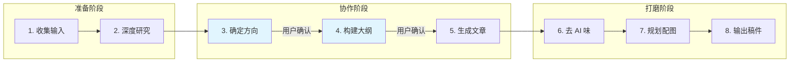

# Technical Writing Skill

将技术素材（播客、视频、文章）转化为高质量原创技术博客的完整工作流。

## 工作流程概览



## 开始前

检查用户写作风格文件：
- 如果存在 `references/user-style.md`，加载并应用用户的写作偏好
- 如果不存在，使用 `references/style-guide-template.md` 作为默认风格
- 可在任何阶段询问用户是否想要保存/更新写作风格

## 阶段 1：收集输入

**必需输入：**
1. **选题**：用户想写的主题或角度
2. **素材 URL**：至少一个相关链接（文章、YouTube、播客等）

**如果用户未提供完整信息，引导式提问：**

```
我来帮你创作这篇技术文章。开始之前，我需要了解：

1. **选题方向**：你想探讨什么主题？有什么独特的角度或观点吗？
2. **素材来源**：有没有相关的文章、视频或播客链接？（这些将作为写作的核心素材）

有了这些信息，我就能帮你深度研究并开始写作了。
```

## 阶段 2：深度研究

对用户提供的每个 URL：

1. **获取内容**：使用 `web_fetch` 或 `web_search` 获取完整内容
2. **提取核心观点**：识别关键论点、数据、引用
3. **识别潜在角度**：寻找可以延伸或讨论的点
4. **记录原始来源**：保留引用信息，用于文末参考资料

**研究完成后，内部整理：**
- 核心概念清单
- 关键引言（保留原文）
- 数据/案例
- 可探讨的延伸方向

## 阶段 3：确定写作方向

**向用户呈现研究发现，并引导其表达观点：**

```markdown
## 研究发现

我深度阅读了你提供的素材，以下是几个核心发现：

1. **[发现1]**：[简述]
2. **[发现2]**：[简述]
3. **[发现3]**：[简述]

## 可能的写作方向

基于这些素材，有几个可能的写作角度：

- **方向 A：[标题]** - [一句话描述]
- **方向 B：[标题]** - [一句话描述]
- **方向 C：[标题]** - [一句话描述]

## 想听听你的想法

- 你对上述哪个方向最感兴趣？
- 有没有你自己的观点或经历想融入文章？
- 你希望读者看完后有什么收获？

你的独特视角是让文章脱颖而出的关键，请大胆分享！
```

**等待用户回应后再进入下一阶段。**

## 阶段 4：构建大纲

基于确定的方向，生成文章大纲：

```markdown
## 文章大纲

**标题**：[拟定标题]

**目标读者**：[描述]

**核心论点**：[一句话总结]

### 结构

1. **开篇**（~300字）
   - 引入背景/话题由来
   - 点明写作动机
   
2. **[章节1标题]**（~800字）
   - 要点 A
   - 要点 B
   
3. **[章节2标题]**（~800字）
   - 要点 A
   - 要点 B

... [更多章节]

N. **总结**（~300字）
   - 核心结论回顾
   - 行动号召或展望

---

这个大纲是否符合你的预期？需要调整哪些部分？
```

**等待用户确认或调整后再进入下一阶段。**

## 阶段 5：生成文章

按照确认的大纲生成完整文章。

**写作原则：**

1. **结构**：
   - 使用 `# 一级标题` 而非 `## 二级标题` 作为章节标题
   - 适合导出到飞书、Word 等平台

2. **引用风格**：
   - 关键原话使用引用块 `>`
   - 首次出现的专有名词附带官方文档 URL
   - 文末附参考资料列表

3. **人称与视角**：
   - 使用"笔者"自称
   - 英文名词保持原文（如 Harrison 而非"哈里森"）

4. **标点符号**：
   - 中文内容使用全角标点：`，`、`。`、`：`、`！`
   - 中文引号使用 `""` 而非 `「」` 或英文引号

5. **长度控制**：
   - 总字数 3000-5000 字为宜
   - 每个章节 500-1000 字

## 阶段 6：审视与去 AI 味

生成初稿后，进行自我审视：

**检查清单：**

| 问题 | 处理方式 |
|------|----------|
| 过度使用"首先、其次、最后" | 改用更自然的过渡 |
| 空洞的总结性语句 | 删除或替换为具体观点 |
| 过度积极/正面的表述 | 加入适度的质疑或权衡 |
| 重复的句式结构 | 变换句式 |
| 不必要的定义解释 | 对专业读者可省略基础解释 |
| 过度使用 bullet points | 转化为流畅的段落叙述 |
| "值得注意的是"、"需要指出的是" | 直接陈述 |

**修改后输出第二版。**

## 阶段 7：规划配图

审视文章，识别适合配图的段落：

**配图选择标准：**
1. 抽象概念需要可视化（如架构对比、流程演进）
2. 核心论点需要强化记忆
3. 文章封面（必需）

### AIGC Prompt 结构化格式

每个配图使用结构化 JSON，共性属性为 `type: "image-prompt"`，其余属性根据图片类型定制：

#### 封面图（cover）

```json
{
  "type": "image-prompt",
  "category": "cover",
  "title": "文章标题",
  "subtitle": "副标题或 slogan",
  "visual_elements": {
    "main_subject": "主视觉元素描述",
    "supporting_elements": ["元素1", "元素2"],
    "mood": "科技感/温暖/专业"
  },
  "style": {
    "illustration_type": "flat illustration",
    "color_scheme": ["#主色", "#辅助色"],
    "background": "clean white"
  },
  "aspect_ratio": "3:2",
  "text_overlay": {
    "enabled": true,
    "language": "chinese"
  }
}
```

#### 对比图（comparison）

```json
{
  "type": "image-prompt",
  "category": "comparison",
  "title": "对比主题",
  "left": {
    "label": "左侧标签",
    "visual": "左侧视觉元素描述",
    "caption": "说明文字"
  },
  "right": {
    "label": "右侧标签",
    "visual": "右侧视觉元素描述",
    "caption": "说明文字"
  },
  "comparison_style": "side_by_side | before_after | versus",
  "style": {
    "illustration_type": "flat illustration",
    "background": "clean white"
  },
  "aspect_ratio": "16:9"
}
```

#### 时间线/演进图（timeline）

```json
{
  "type": "image-prompt",
  "category": "timeline",
  "title": "演进主题",
  "stages": [
    {
      "label": "阶段1",
      "time": "2022",
      "visual": "视觉元素描述",
      "caption": "说明"
    },
    {
      "label": "阶段2",
      "time": "2024",
      "visual": "视觉元素描述",
      "caption": "说明"
    }
  ],
  "direction": "horizontal | vertical",
  "metaphor": "交通工具演进 | 生物进化 | 建筑层次",
  "style": {
    "illustration_type": "flat illustration",
    "background": "clean white"
  },
  "aspect_ratio": "21:9"
}
```

#### 概念图（concept）

```json
{
  "type": "image-prompt",
  "category": "concept",
  "title": "概念名称",
  "central_element": {
    "visual": "中心视觉元素",
    "label": "核心标签"
  },
  "surrounding_elements": [
    {"visual": "元素1", "label": "标签1"},
    {"visual": "元素2", "label": "标签2"}
  ],
  "relationships": "辐射 | 环绕 | 连接",
  "metaphor": "DJ混音台 | 工匠工作台 | 珊瑚礁",
  "style": {
    "illustration_type": "isometric | flat",
    "background": "clean white"
  },
  "aspect_ratio": "4:3"
}
```

#### 比喻图（metaphor）

```json
{
  "type": "image-prompt",
  "category": "metaphor",
  "abstract_concept": "要解释的抽象概念",
  "metaphor_theme": "乐高积木 | 探险家 | 马拉松",
  "scene": {
    "setting": "场景描述",
    "main_character": "主角描述",
    "props": ["道具1", "道具2"],
    "action": "正在做什么"
  },
  "labels": [
    {"element": "场景元素", "meaning": "对应的抽象含义"}
  ],
  "style": {
    "illustration_type": "flat illustration",
    "tone": "friendly | professional | playful",
    "background": "clean white"
  },
  "aspect_ratio": "16:9"
}
```

#### 层次架构图（hierarchy）

```json
{
  "type": "image-prompt",
  "category": "hierarchy",
  "title": "架构名称",
  "layers": [
    {
      "level": 1,
      "name": "底层",
      "visual": "视觉表现",
      "description": "说明"
    },
    {
      "level": 2,
      "name": "中层",
      "visual": "视觉表现",
      "description": "说明"
    }
  ],
  "metaphor": "乐高（散件→积木桶→套件）| 建筑地基",
  "direction": "bottom_up | top_down",
  "style": {
    "illustration_type": "isometric",
    "background": "clean white"
  },
  "aspect_ratio": "16:9"
}
```

### 配图原则

- 背景统一为干净的白色
- 文字使用中文，简明清晰
- 鼓励使用创意比喻（乐高、交通工具、工匠工具等）
- 同一篇文章的配图风格保持一致

**在文章相应位置插入配图占位符：**

```markdown
<!-- 配图：[配图名称] -->

​```json
{
  "type": "image-prompt",
  "category": "...",
  ...
}
​```
```

## 阶段 8：输出最终稿件

在文章开头添加 YAML frontmatter：

```yaml
---
title: "文章标题"
description: "引人入胜的文章简介（50-100字）"
cover_prompt:
  type: "image-prompt"
  category: "cover"
  title: "文章标题"
  subtitle: "副标题"
  visual_elements:
    main_subject: "主视觉元素"
    supporting_elements: []
    mood: "科技感"
  style:
    illustration_type: "flat illustration"
    color_scheme: ["tech blue", "warm orange"]
    background: "clean white"
  aspect_ratio: "3:2"
  text_overlay:
    enabled: true
    language: "chinese"
date: "YYYY-MM-DD"
author: "[作者名]"
tags:
  - tag1
  - tag2
---
```

**最终输出：**
1. 将完整文章保存为 `.md` 文件
2. 使用 `present_files` 工具提供给用户

## 用户风格管理

如果用户希望保存写作风格以便复用：

1. 询问用户的偏好：
   - 常用人称（笔者/我/作者）
   - 目标读者群体
   - 偏好的文章长度
   - 引用风格
   - 其他特殊要求

2. 生成 `references/user-style.md` 文件

3. 后续写作自动加载此风格文件

---

## 参考文件

- `references/style-guide-template.md`：默认写作风格模板
- `references/user-style.md`：用户自定义写作风格（如存在）
